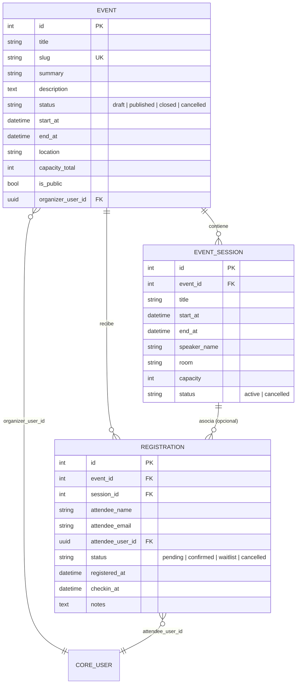
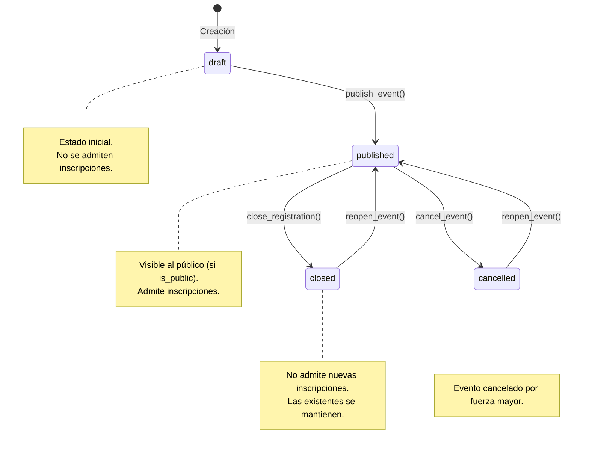
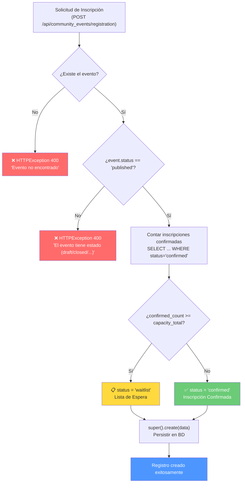

# Community Events — Módulo Nivel 4

> **Módulo de gestión de eventos comunitarios** que implementa un sistema completo de inscripciones con control automático de aforo, listas de espera, check-in de asistentes y validación estricta de estados de publicación. Incluye sesiones internas por evento y seguridad basada en ACL con dominios condicionales.

---

## Índice

- [Arquitectura y Manifiesto](#arquitectura-y-manifiesto)
- [Modelo de Datos y Lógica de Aforo](#modelo-de-datos-y-lógica-de-aforo)
- [Flujo de Inscripción (Aforo Automático)](#flujo-de-inscripción-aforo-automático)
- [Matriz de Trazabilidad de Seguridad (ACL)](#matriz-de-trazabilidad-de-seguridad-acl)
- [API y Acciones Expuestas](#api-y-acciones-expuestas)
- [Vistas Declarativas en Licium](#vistas-declarativas-en-licium)
- [Pruebas Unitarias (Lógica de Mocks)](#pruebas-unitarias-lógica-de-mocks)
- [Guía de Troubleshooting (Lecciones Aprendidas)](#guía-de-troubleshooting-lecciones-aprendidas)

---

## Arquitectura y Manifiesto

### Estructura del módulo

El módulo `community_events` sigue la arquitectura estándar de Licium con separación estricta en capas:

```
modules/community_events/
├── __init__.py              # Registro: importa models y services
├── __manifest__.yaml        # Metadatos, dependencias y orden de carga
├── models/                  # 🗄️  Capa de Datos
│   ├── __init__.py          #     Importa event, session, registration
│   ├── event.py             #     Evento principal con aforo y estados
│   ├── session.py           #     Sesiones internas del evento (Many-to-One)
│   └── registration.py      #     Inscripciones con lógica de waitlist
├── services/                # ⚙️  Capa de Negocio
│   ├── __init__.py
│   ├── event.py             #     publish / close / cancel / reopen
│   ├── session.py           #     CRUD base (sin acciones custom)
│   └── registration.py      #     confirm / move_waitlist / checkin / bulk_checkin + create override
├── views/                   # 🖼️  Capa de Presentación (YAML)
│   ├── views.yml            #     Listas, formularios, row_actions y header_actions
│   └── menu.yml             #     Menú de navegación jerárquico
├── data/                    # 🔐 Seguridad y Configuración
│   ├── groups.yml           #     Grupos: Staff + Visualizador (Público)
│   ├── acl_rules.yml        #     Reglas ACL con dominio condicional
│   ├── settings.yml         #     Configuración del módulo (waitlist, aforo default)
│   └── ui_modules.yml       #     Registro del módulo en el frontend (ui.uimodule)
└── tests/                   # ✅ Pruebas Unitarias
    └── test_registration_service.py
```

### Manifiesto (`__manifest__.yaml`)

```yaml
name: "Community Events"
technical_name: "community_events"
version: "1.0.0"
category: "Community"
summary: "Gestión de eventos, sesiones internas e inscripciones de la comunidad."
depends:
  - core           # Obligatorio: modelos base, BaseService, ACL
  - ui             # Obligatorio: para registrar ui.view, ui.action y ui.menuitem
data:
  - data/ui_modules.yml   # 1️⃣ Primero: registrar el módulo en el frontend
  - data/settings.yml     # 2️⃣ Segundo: configuración del módulo
  - data/groups.yml       # 3️⃣ Tercero: crear grupos de seguridad
  - data/acl_rules.yml    # 4️⃣ Cuarto: reglas ACL (dependen de los grupos)
  - views/views.yml       # 5️⃣ Quinto: definir vistas (listas, formularios, acciones)
  - views/menu.yml        # 6️⃣ Sexto: menú de navegación (depende de las acciones)
```

> **⚠️ Orden de carga**: El instalador de Licium lee los archivos de datos **secuencialmente**. En `views.yml`, las vistas (`ui.view`) deben definirse **antes** que las acciones (`ui.action`) que las referencian, o se lanzará un error `ExternalId not found`.

### Nota Crítica: `PYTHONPATH` en Docker

Los tests de este módulo se ejecutan dentro de un contenedor Docker aislado. Para que las importaciones absolutas del framework (`from app.core.base import ...`) resuelvan correctamente, es **obligatorio** establecer:

```bash
PYTHONPATH=/opt/licium
```

Sin esta variable, Python no encontrará el paquete `app` y los tests fallarán con `ModuleNotFoundError`. El comando completo de ejecución es:

```bash
docker compose -f docker-compose.backend-dev.yml exec \
  -e PYTHONPATH=/opt/licium backend \
  pytest modules/community_events/tests/test_registration_service.py
```

### Configuración del módulo (`settings.yml`)

El módulo registra tres parámetros configurables en `core.setting`:

| Clave | Tipo | Valor Default | Propósito |
|-------|------|:---:|-----------|
| `community_events.allow_waitlist` | `bool` | `true` | Habilita la lista de espera cuando se agota el aforo |
| `community_events.default_capacity` | `int` | `50` | Aforo predeterminado para nuevos eventos |
| `community_events.auto_confirm` | `bool` | `false` | Confirmación automática sin intervención de staff |

---

## Modelo de Datos y Lógica de Aforo

El módulo define tres entidades principales con relaciones jerárquicas:



### `Event` — Eventos

Entidad principal del módulo. Representa un evento comunitario con control de aforo y estados de publicación.

| Campo | Tipo | Propósito |
|-------|------|-----------|
| `title` | `String(150)` | Título descriptivo del evento |
| `slug` | `String(150)`, `unique` | Identificador URL-safe |
| `summary` | `String(255)` | Resumen corto |
| `description` | `Text` | Descripción detallada |
| `status` | `String(20)` | Estado: `draft` · `published` · `closed` · `cancelled` |
| `start_at` | `DateTime(tz)` | Fecha y hora de inicio (**ISO 8601**) |
| `end_at` | `DateTime(tz)` | Fecha y hora de fin (**ISO 8601**) |
| `location` | `String(255)` | Ubicación del evento |
| `capacity_total` | `Integer` | Aforo máximo (controla lógica de waitlist) |
| `is_public` | `Boolean` | Visibilidad pública del evento |
| `organizer_user_id` | **`Uuid`**, `FK → core_user.id` | Usuario organizador |

> **⚠️ Tipado de `organizer_user_id`**: Este campo **debe ser de tipo `Uuid`** porque `core_user.id` en Licium es UUID nativo de PostgreSQL. Usar `Integer` provoca un `DatatypeMismatch` irreversible.

#### Estados del Evento



#### Relaciones

- **`sessions`** → `EventSession` (One-to-Many): Sesiones internas del evento. `cascade="all, delete-orphan"`.
- **`registrations`** → `Registration` (One-to-Many): Inscripciones al evento. `cascade="all, delete-orphan"`.

### `EventSession` — Sesiones

Cada evento puede tener múltiples sesiones internas (talleres, ponencias, etc.). Relación **Many-to-One** con `Event`.

| Campo | Tipo | Propósito |
|-------|------|-----------|
| `event_id` | `Integer`, `FK → community_event.id` | Evento padre (CASCADE) |
| `title` | `String(150)` | Título de la sesión |
| `start_at` | `DateTime(tz)` | Inicio de la sesión (**ISO 8601**) |
| `end_at` | `DateTime(tz)` | Fin de la sesión (**ISO 8601**) |
| `speaker_name` | `String(150)` | Nombre del ponente (opcional) |
| `room` | `String(100)` | Sala o espacio (opcional) |
| `capacity` | `Integer` | Aforo propio de la sesión (opcional) |
| `status` | `String(50)` | `active` · `cancelled` |

> **Nota**: La FK `event_id` es de tipo `Integer` porque apunta a un modelo propio del módulo (`community_event.id` es SERIAL). **Solo las FK a `core_user` deben ser `Uuid`**.

### `Registration` — Inscripciones

Entidad que controla las inscripciones de los asistentes, con lógica automática de aforo.

| Campo | Tipo | Propósito |
|-------|------|-----------|
| `event_id` | `Integer`, `FK → community_event.id` | Evento (CASCADE) |
| `session_id` | `Integer`, `FK → community_event_session.id` | Sesión opcional (SET NULL) |
| `attendee_name` | `String(150)` | Nombre del asistente |
| `attendee_email` | `String(150)` | Email de contacto |
| `attendee_user_id` | **`Uuid`**, `FK → core_user.id` | Usuario autenticado (opcional) |
| `status` | `String(50)` | `pending` · `confirmed` · `waitlist` · `cancelled` |
| `registered_at` | `DateTime(tz)` | Fecha de registro (auto: `now()`) |
| `checkin_at` | `DateTime(tz)` | Fecha de check-in (se rellena al hacer checkin) |
| `notes` | `Text` | Notas adicionales (opcional) |

#### Propiedades mágicas del ORM

Cada modelo en Licium **requiere** estas propiedades para conectar el ORM con la API:

```python
class Registration(Base):
    __tablename__ = "community_event_registration"
    __abstract__ = False       # ← Obligatorio: indica que NO es un modelo abstracto
    __model__ = "registration"  # ← Clave del modelo en la API (community_events.registration)
    __service__ = "modules.community_events.services.registration.RegistrationService"
```

> **⚠️ Si falta alguna de estas propiedades**, el modelo devolverá **404 (Model Not Found)** en el frontend. Ver [Troubleshooting](#error-404-model-not-found).

---

## Flujo de Inscripción (Aforo Automático)

La lógica de negocio más crítica del módulo es el **sistema de aforo automático** implementado en `RegistrationService.create()`. Este método sobrescribe el `create()` base de Licium para inyectar validaciones antes de persistir la inscripción.

### Diagrama de flujo



### Implementación en código

```python
class RegistrationService(BaseService):
    from ..models.registration import Registration
    from ..models.event import Event

    def create(self, data: dict) -> dict:
        """Sobrescribe la creación base para calcular automáticamente si hay aforo."""
        event_id = data.get("event_id")
        event = self.repo.session.get(self.Event, int(event_id))

        # 1. Validación de estado: SOLO eventos 'published' admiten inscripciones
        if not event or event.status != "published":
            raise HTTPException(
                status_code=400,
                detail=f"Error: El evento {event_id} tiene estado "
                       f"'{event.status if event else 'N/A'}'"
            )

        # 2. Conteo de confirmados actuales
        stmt = select(self.Registration).where(
            self.Registration.event_id == int(event_id),
            self.Registration.status == "confirmed"
        )
        confirmed_count = len(self.repo.session.scalars(stmt).all())

        # 3. Decisión de aforo
        if confirmed_count >= (event.capacity_total or 0):
            data["status"] = "waitlist"      # ← Sin plaza: lista de espera
        else:
            data["status"] = "confirmed"     # ← Con plaza: confirmada

        return super().create(data)
```

### Tabla de decisión de aforo

| Condición | `confirmed_count` | `capacity_total` | Estado asignado |
|:---:|:---:|:---:|:---:|
| Hay plaza | 3 | 10 | `confirmed` ✅ |
| Aforo completo | 10 | 10 | `waitlist` 📋 |
| Aforo cero | 0 | 0 | `waitlist` 📋 |

### Validación de seguridad: estados permitidos

Las inscripciones **solo** se admiten cuando `event.status == "published"`. Si el estado es cualquier otro valor, el sistema lanza `HTTPException 400`:

| Estado del Evento | ¿Se admiten inscripciones? | Resultado |
|:---:|:---:|:---|
| `draft` | ❌ | Error 400: "El evento tiene estado 'draft'" |
| `published` | ✅ | Lógica de aforo se ejecuta |
| `closed` | ❌ | Error 400: "El evento tiene estado 'closed'" |
| `cancelled` | ❌ | Error 400: "El evento tiene estado 'cancelled'" |

> **⚠️ Error común**: Confundir `"public"` (string manual incorrecto) con `"published"` (valor real del desplegable `choices`). Un evento con `status = "public"` **nunca** admitirá inscripciones. Ver [Troubleshooting: Validación Estricta de Estados](#6-validación-estricta-de-estados).

---

## Matriz de Trazabilidad de Seguridad (ACL)

### Grupos de seguridad

| Grupo | `ext_id` | Propósito |
|-------|----------|-----------|
| **Staff** | `community_events_group_staff` | CRUD total + acciones de gestión |
| **Público / Visualizador** | `community_events_group_viewer` | Lectura filtrada + crear inscripciones |

### Matriz de permisos

| Grupo | Modelo | Ver | Crear | Acciones (Confirmar/Check-in) | Condición (Domain) |
|:---|:---|:---:|:---:|:---:|:---|
| **Staff** | Todos (`community_events.*`) | ✅ | ✅ | ✅ | Acceso Total (wildcard `*`) |
| **Público** | `Event` | ✅ | ❌ | ❌ | Solo `status='published'` AND `is_public=true` |
| **Público** | `EventSession` | ✅ | ❌ | ❌ | Lectura total (sin dominio) |
| **Público** | `Registration` | ❌ | ✅ | ❌ | Solo puede **crear** inscripciones |

### Implementación en `acl_rules.yml`

```yaml
# 1. Staff: poder absoluto con wildcard
- model: core.aclrule
  ext_id: acl_events_staff_all
  fields:
    group_id.ext_id: community_events_group_staff
    model_key: "community_events.*"        # ← Wildcard: cubre TODOS los modelos
    perm_read: true
    perm_create: true
    perm_write: true
    perm_delete: true

# 2. Público: solo lee eventos PUBLICADOS y PÚBLICOS
- model: core.aclrule
  ext_id: acl_events_viewer_read_event
  fields:
    group_id.ext_id: community_events_group_viewer
    model_key: "community_events.event"
    perm_read: true
    domain:
      - { field: "status", operator: "=", value: "published" }
      - { field: "is_public", operator: "=", value: true }

# 3. Público: lee sesiones (necesario para la UI de inscripción)
- model: core.aclrule
  ext_id: acl_events_viewer_read_session
  fields:
    group_id.ext_id: community_events_group_viewer
    model_key: "community_events.session"
    perm_read: true

# 4. Público: puede CREAR inscripciones (la validación la hace el servicio)
- model: core.aclrule
  ext_id: acl_events_viewer_create_registration
  fields:
    group_id.ext_id: community_events_group_viewer
    model_key: "community_events.registration"
    perm_create: true
```

**¿Por qué el público puede crear inscripciones pero NO leerlas?** El `perm_create` permite al usuario realizar la acción de inscribirse, pero la **validación de aforo y estado** la realiza `RegistrationService.create()` en la capa de servicio. El público no tiene `perm_read` explícito sobre registrations, lo que impide listar las inscripciones de otros usuarios desde la API.

---

## API y Acciones Expuestas

### `EventService` — Gestión del ciclo de vida del evento

| Acción | Decorador | Transición | Validación |
|--------|-----------|:---:|:---|
| `publish_event()` | `@exposed_action("write")` | `draft → published` | Solo eventos en `draft` |
| `close_registration()` | `@exposed_action("write")` | `published → closed` | Solo eventos en `published` |
| `cancel_event()` | `@exposed_action("write")` | `* → cancelled` | No se puede cancelar si ya está cancelado |
| `reopen_event()` | `@exposed_action("write")` | `closed/cancelled → published` | Solo `closed` o `cancelled` |

> **Nota de diseño**: En los métodos de `EventService`, las validaciones de transición usan `ValueError` (no `HTTPException`) para que Licium procese el error correctamente en el frontend. Solo se usa `HTTPException` para errores de búsqueda (404). Ver [Troubleshooting: HTTPException vs ValidationError](#3-httpexception-vs-validationerror).

### `RegistrationService` — Acciones sobre inscripciones

| Acción | Parámetros | Efecto | Icono UI |
|--------|------------|--------|:---:|
| `confirm` | `id: int`, `note: str \| None` | `waitlist/pending → confirmed` | `mdi-check-circle` |
| `move_waitlist` | `id: int`, `note: str \| None` | `* → waitlist` | — |
| `checkin` | `id: int` | Marca `checkin_at = now()` | `mdi-map-marker-check` |
| `bulk_checkin` | `ids: list[int]` | Check-in masivo para varios asistentes | — |

#### Validaciones de `checkin`

```python
@exposed_action("write", groups=["community_events_group_staff", "core_group_superadmin"])
def checkin(self, id: int) -> dict:
    reg = self.repo.session.get(self.Registration, int(id))
    if not reg: raise HTTPException(400, "Inscripción no encontrada")

    if reg.status != "confirmed":
        raise ValueError("Solo los asistentes confirmados pueden hacer check-in.")
    if reg.checkin_at:
        raise ValueError("Este asistente ya ha entrado al evento.")

    reg.checkin_at = dt.datetime.now(dt.timezone.utc)
    # ...
```

- Solo se puede hacer check-in a inscripciones `confirmed`.
- No se permite doble check-in (se comprueba `checkin_at`).

### `SessionService` — CRUD base

```python
class SessionService(BaseService):
    from ..models.session import EventSession
    # No se requieren acciones personalizadas, el CRUD base es suficiente.
```

### Integración con vistas: `row_actions` y `header_actions`

Las acciones del servicio se vinculan a la UI mediante configuración declarativa en `views.yml`:

```yaml
# En la vista de lista de Inscripciones
row_actions:
  - key: action_confirm_reg
    type: service
    label: "Confirmar"
    icon: mdi-check-circle            # ← Icono Material Design
    method: confirm                    # ← Llama a RegistrationService.confirm()
    model_key: community_events.registration

  - key: action_checkin_reg
    type: service
    label: "Hacer Check-in"
    icon: mdi-map-marker-check
    method: checkin
    model_key: community_events.registration
```

```yaml
# En el formulario de Evento
header_actions:
  - key: action_publish_event
    type: service
    label: "Publicar"
    icon: mdi-earth
    method: publish_event
    model_key: community_events.event

  - key: action_close_reg
    type: service
    label: "Cerrar Inscripciones"
    icon: mdi-door-closed
    method: close_registration
    model_key: community_events.event
```

### Ciclo completo: del botón al backend

```
 Clic "Confirmar"     Diálogo auto        POST /api/...          Service
      (row_action)   ──▶  note: str?   ──▶  confirm()       ──▶  status = "confirmed"
                          [Aceptar]          id + note             session.commit()
```

---

## Vistas Declarativas en Licium

### Arquitectura de vistas nativas

Licium **no usa vistas XML tradicionales** (como Odoo). En su lugar, utiliza **Vistas Nativas YAML/JSON** registradas como instancias del modelo `ui.view`. El frontend Nuxt interpreta estas definiciones para renderizar listas, formularios y acciones de manera completamente declarativa.

### Registro del módulo de UI (`ui_modules.yml`)

```yaml
- model: ui.uimodule
  ext_id: ui_module_community_events
  fields:
    slug: community-events             # ← Ruta base en el frontend
    name: "Eventos"
    technical_name: "community_events"
    icon: "mdi-calendar-star"
    version: "1.0.0"
    description: "Gestión de eventos, sesiones e inscripciones de la comunidad."
```

El registro mediante `ui.uimodule` habilita el **ruteo automático en Vue/Nuxt**: el frontend detecta el módulo y genera las rutas `/community-events/*` basándose en las `ui.action` definidas en `views.yml`.

### Estructura de vistas definidas

| `ext_id` | Tipo | Modelo | Propósito |
|----------|------|--------|-----------|
| `events_view_event_list` | `list` | `community_events.event` | Lista de eventos con columnas: título, estado, inicio, aforo |
| `events_view_event_form` | `form` | `community_events.event` | Formulario con 3 grupos + `header_actions` |
| `events_view_session_list` | `list` | `community_events.session` | Lista de sesiones por evento |
| `events_view_session_form` | `form` | `community_events.session` | Formulario de sesión: horario, ponente, sala |
| `events_view_registration_list` | `list` | `community_events.registration` | Lista de inscripciones con `row_actions` |
| `events_view_registration_form` | `form` | `community_events.registration` | Formulario de inscripción: datos + estado |

### Menú de navegación

```
📅 Eventos (raíz)
├── Gestión de Eventos     → /community-events/events
├── Sesiones               → /community-events/sessions
└── Inscripciones          → /community-events/registrations
```

---

## Pruebas Unitarias (Lógica de Mocks)

### Archivo: `tests/test_registration_service.py`

El módulo incluye tests unitarios que validan la lógica de aforo y las restricciones de estado **sin necesidad de una base de datos real**, utilizando `pytest` y `unittest.mock`.

### ¿Por qué MagicMock y no instancias reales?

Al ejecutar tests unitarios en un entorno aislado (sin el ORM completo de Licium cargado), instanciar modelos reales de SQLAlchemy provoca el error:

```
sqlalchemy.exc.InvalidRequestError: Multiple classes found for path "EventSession"
```

Esto ocurre porque SQLAlchemy mantiene un **registro global de modelos** (mapper registry). Al importar los modelos del módulo en un test aislado, colisionan con otros modelos que podrían estar registrados. La solución es usar `MagicMock()` para simular objetos sin activar el ORM:

```python
# ❌ Provoca conflictos de registry
from modules.community_events.models.event import Event
mock_event = Event(id=1, status="draft", capacity_total=2)

# ✅ Aislado y seguro: no toca el registry de SQLAlchemy
mock_event = MagicMock()
mock_event.id = 1
mock_event.status = "draft"
mock_event.capacity_total = 2
```

### Estrategia de testing

1. **Simulación del repositorio**: Se usa `MagicMock()` para crear un repositorio falso con una sesión de base de datos simulada.
2. **Inyección en el servicio**: Se pasa el mock al constructor de `RegistrationService`.
3. **Validación de resultados**: Se comprueba que los errores correctos se lanzan o que los datos se modifican como se espera.

```python
@pytest.fixture
def mock_service():
    """Crea una instancia del servicio con una sesión de DB simulada."""
    mock_repo = MagicMock()
    mock_repo.session = MagicMock()
    service = RegistrationService(mock_repo)
    return service
```

### Tests implementados

| Test | Verifica |
|------|----------|
| `test_registration_closed_event_raises_error` | HTTPException 400 si el evento está en `draft` (no `published`) |
| `test_registration_waitlist_logic` | Si el aforo está lleno, `data["status"]` cambia a `waitlist` |

### Test: evento en borrador lanza error

```python
def test_registration_closed_event_raises_error(mock_service):
    """Prueba que no se pueda inscribir en un evento en borrador (draft)."""
    mock_event = MagicMock()
    mock_event.id = 1
    mock_event.status = "draft"          # ← No es 'published'
    mock_event.capacity_total = 2

    mock_service.repo.session.get.return_value = mock_event

    with pytest.raises(HTTPException) as exc_info:
        mock_service.create({
            "event_id": 1,
            "attendee_name": "Paco Pepe",
            "attendee_email": "paco@test.com"
        })

    assert exc_info.value.status_code == 400
    assert "estado" in exc_info.value.detail.lower()
    assert "draft" in exc_info.value.detail.lower()
```

### Test: lógica de waitlist

```python
def test_registration_waitlist_logic(mock_service):
    """Prueba que la inscripción pase a waitlist si el aforo está completo."""
    mock_event = MagicMock()
    mock_event.id = 1
    mock_event.status = "published"
    mock_event.capacity_total = 1        # ← Solo 1 plaza

    # Simulamos que ya hay 1 persona confirmada
    mock_service.repo.session.scalars().all.return_value = [MagicMock()]
    mock_service.repo.session.get.return_value = mock_event

    data = {
        "event_id": 1,
        "attendee_name": "Juan",
        "attendee_email": "juan@test.com"
    }

    try:
        mock_service.create(data)
    except:
        pass  # super().create() falla sin DB, pero la lógica ya se ejecutó

    assert data["status"] == "waitlist"  # ← Verificamos la asignación de waitlist
```

### Comando de ejecución

```bash
docker compose -f docker-compose.backend-dev.yml exec \
  -e PYTHONPATH=/opt/licium backend \
  pytest modules/community_events/tests/test_registration_service.py -v
```

Salida esperada:

```
test_registration_service.py::test_registration_closed_event_raises_error     PASSED
test_registration_service.py::test_registration_waitlist_logic                PASSED

========================= 2 passed =========================
```

> **Nota**: Los tests utilizan `unittest.mock.MagicMock` para simular la sesión de base de datos, por lo que **no requieren una instancia de PostgreSQL activa** ni la variable `PYTHONPATH` en tiempo de ejecución local. Sin embargo, para ejecutarlos dentro del contenedor Docker, la variable es necesaria.

---

## Guía de Troubleshooting (Lecciones Aprendidas)

### 1. `DatatypeMismatch` en Foreign Keys

**Síntoma**: Al instalar el módulo, PostgreSQL lanza:

```
sqlalchemy.exc.ProgrammingError: (psycopg2.errors.DatatypeMismatch)
  Key columns "organizer_user_id" and "id" are of incompatible types: integer and uuid.
```

**Causa**: Las FK que apuntan a `core_user.id` se definieron como `Integer`, pero `core_user.id` es de tipo `UUID` nativo en PostgreSQL.

**Regla**: Las FK a modelos **propios** del módulo (como `Event` o `EventSession`) deben ser `Integer` (SERIAL). Las FK a **`core_user`** deben ser **estrictamente `Uuid`**.

```diff
# FK a modelo propio (Integer = correcto)
  event_id = field(Integer, ForeignKey("community_event.id", ondelete="CASCADE"), ...)

# FK a core_user (Uuid = obligatorio)
- organizer_user_id = field(Integer, ForeignKey("core_user.id"), ...)
+ organizer_user_id = field(Uuid, ForeignKey("core_user.id", ondelete="SET NULL"), ...)
```

---

### 2. Error 404 (Model Not Found)

**Síntoma**: El modelo se crea sin errores en el backend, pero al acceder desde el frontend devuelve `404 Not Found`.

**Causas y soluciones**:

| Causa | Solución |
|:---|:---|
| Modelo no importado en `__init__.py` | Añadir `from . import event, session, registration` en `models/__init__.py` |
| Falta `__abstract__ = False` | Añadirlo a la clase del modelo |
| Falta `__model__` | Añadir `__model__ = "registration"` (nombre corto sin prefijo del módulo) |
| Falta `__service__` | Añadir el path absoluto: `"modules.community_events.services.registration.RegistrationService"` |

**Las tres propiedades mágicas son obligatorias:**

```python
class Registration(Base):
    __tablename__ = "community_event_registration"
    __abstract__ = False         # ← 1. NO es abstracto
    __model__ = "registration"   # ← 2. Clave de la API
    __service__ = "modules.community_events.services.registration.RegistrationService"  # ← 3. Path al servicio
```

---

### 3. `HTTPException` vs `ValidationError`

**Síntoma**: Un método del servicio que usa `HTTPException` funciona bien en `@exposed_action`, pero al usarlo en un método sobrescrito del ORM (como `create()`) provoca un **Error 500 Internal Server Error** en lugar de mostrar el mensaje al usuario.

**Causa**: Licium maneja diferente los errores según la capa:

| Capa | Tipo de Error Correcto | Resultado |
|:---|:---|:---|
| `@exposed_action` (API) | `HTTPException` | ✅ Status code + mensaje al frontend |
| `create()` / `write()` (ORM) | `ValueError` o `ValidationError` | ✅ Licium lo convierte en 400 con mensaje |
| `create()` / `write()` (ORM) | `HTTPException` | ❌ Error 500 — Licium no lo procesa |

**Ejemplo en `RegistrationService`:**

```python
def create(self, data: dict) -> dict:
    # ⚠️ En create(), se usa HTTPException porque la lógica requiere status_code,
    # pero idealmente debería ser ValueError para que Licium lo procese correctamente.
    if not event or event.status != "published":
        raise HTTPException(status_code=400, detail="...")
    # ...

@exposed_action("write", ...)
def confirm(self, id: int, note: str | None = None) -> dict:
    # ✅ En @exposed_action, ValueError es procesado por Licium
    if reg.status == "cancelled":
        raise ValueError("No se puede confirmar una inscripción cancelada.")
```

> **Recomendación**: En métodos sobrescritos del core (`create`, `write`, `delete`), usar **`ValueError`** nativo. En `@exposed_action`, ambos son válidos, pero `ValueError` es más idiomático.

---

### 4. Conflictos de Registro en SQLAlchemy (Tests)

**Síntoma**: Al importar modelos reales de SQLAlchemy en tests unitarios aislados:

```
sqlalchemy.exc.InvalidRequestError: Multiple classes found for path "EventSession"
```

**Causa**: SQLAlchemy mantiene un registro global de clases mapeadas. Al importar los modelos fuera del contexto completo del framework, el registry detecta duplicados.

**Solución**: Usar `MagicMock()` para simular los objetos en lugar de instanciar modelos reales:

```python
# ❌ Activa el registry de SQLAlchemy → conflictos
from modules.community_events.models.event import Event
event = Event(id=1, status="published")

# ✅ Aislado: no toca el ORM
event = MagicMock()
event.id = 1
event.status = "published"
```

---

### 5. Orden de Ejecución YAML

**Síntoma**: Al instalar el módulo, el framework lanza:

```
ExternalId not found: events_view_event_list
```

**Causa**: En `views.yml`, las acciones (`ui.action`) referencian vistas (`ui.view`) mediante `ext_id`. Si las acciones se definen **antes** que las vistas, el instalador no encuentra la referencia.

**Solución**: En `views.yml`, **siempre definir las vistas primero y las acciones después**:

```yaml
# ✅ Orden correcto en views.yml:
# 1. Vistas (ui.view)          ← Se crean primero
# 2. Acciones (ui.action)      ← Referencian las vistas ya creadas

# ❌ Orden incorrecto: acción antes de vista
- model: ui.action
  ext_id: action_community_events_event
  fields:
    default_multi_read_view_id.ext_id: events_view_event_list  # ← ¡No existe todavía!
```

---

### 6. Validación Estricta de Estados

**Síntoma**: Al crear una inscripción, el sistema devuelve `Bad Request 400` con el mensaje:

```
"Error: El evento 1 tiene estado 'public'"
```

**Causa**: El campo `status` del evento se rellenó manualmente con el string `"public"` en vez de seleccionar `"published"` del desplegable. La lógica de `RegistrationService.create()` compara **exactamente** contra `"published"`.

**Solución**: El campo `status` del modelo `Event` está tipado con la propiedad `choices`:

```python
status = field(
    String(20),
    default="draft",
    info={
        "choices": [
            {"value": "draft", "label": {"es": "Borrador"}},
            {"value": "published", "label": {"es": "Publicado"}},
            {"value": "closed", "label": {"es": "Cerrado"}},
            {"value": "cancelled", "label": {"es": "Cancelado"}},
        ],
    },
)
```

Los `choices` garantizan que el frontend presente un desplegable con las opciones correctas, evitando errores de escritura manual. **Nunca** editar el campo `status` directamente en la base de datos con valores que no estén en la lista de `choices`.

### 7. Formato ISO 8601 para DateTime

**Síntoma**: Al crear sesiones con horarios, el backend devuelve `Error 500 Internal Server Error`.

**Causa**: Los campos `DateTime(timezone=True)` de SQLAlchemy esperan cadenas en formato **ISO 8601** con zona horaria. Fechas en formatos como `"23/03/2026 10:00"` o `"March 23, 2026"` provocan errores de parsing.

**Formato correcto**:

```
✅  "2026-03-23T10:00:00+01:00"     (ISO 8601 con timezone)
✅  "2026-03-23T09:00:00Z"          (ISO 8601 UTC)
❌  "23/03/2026 10:00"               (formato europeo → Error 500)
❌  "March 23, 2026 10:00 AM"        (formato textual → Error 500)
```

---

## Resumen de Hitos Técnicos

| Hito | Descripción |
|------|-------------|
| ✅ Gestión de Aforo Automática | Inscripciones se confirman o pasan a waitlist según `capacity_total` |
| ✅ Lista de Espera (Waitlist) | Sistema automático cuando se agota el aforo, con acción manual de confirmación |
| ✅ Sesiones por Evento | Relación One-to-Many con `EventSession` para organizar talleres y ponencias |
| ✅ Check-in de Asistentes | Acción individual y masiva (`bulk_checkin`) con timestamp UTC |
| ✅ Máquina de Estados del Evento | 4 estados (`draft`, `published`, `closed`, `cancelled`) con transiciones controladas |
| ✅ Validación Estricta de Estados | Solo eventos `published` admiten inscripciones — `choices` previene errores |
| ✅ Seguridad ACL con Domain Rules | Público solo ve eventos `published + is_public`, Staff tiene wildcard `*` |
| ✅ FK tipadas correctamente | `Uuid` para `core_user`, `Integer` para modelos propios |
| ✅ Tests unitarios con MagicMock | 2 tests cubriendo validación de estados y lógica de waitlist sin DB real |
| ✅ Vistas declarativas YAML | Listas, formularios, `row_actions` y `header_actions` sin código frontend |
