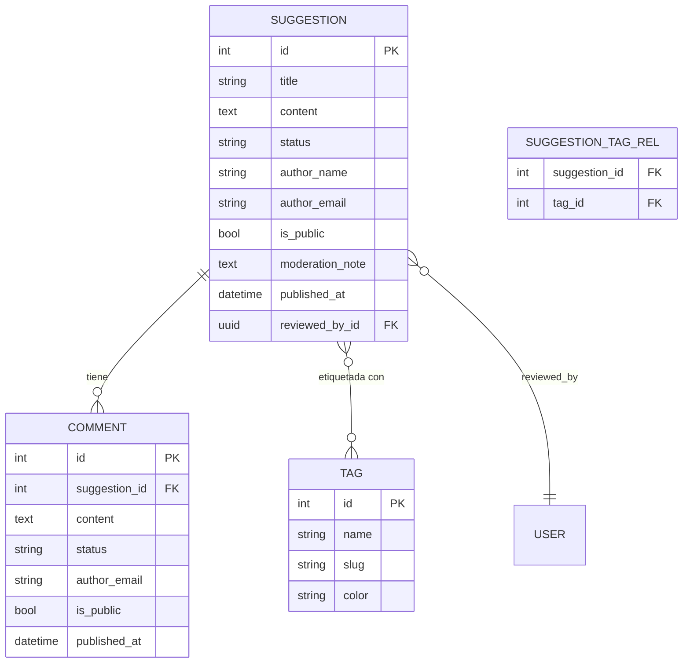
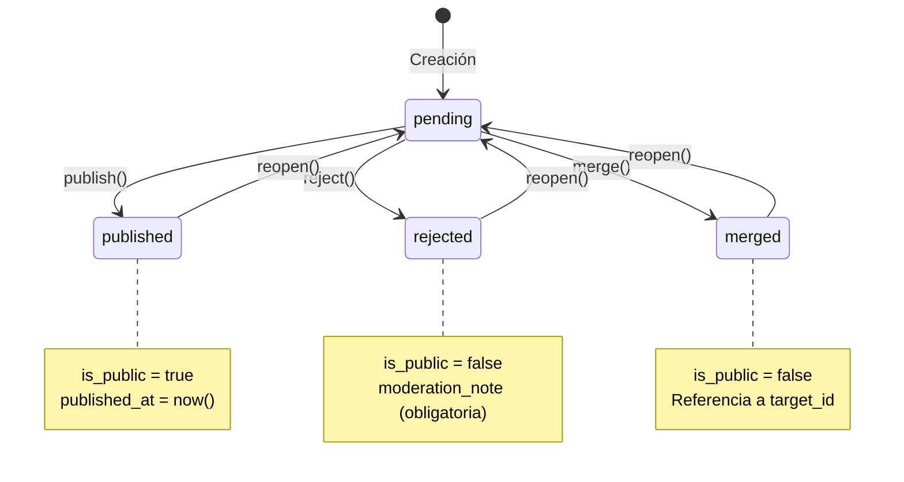
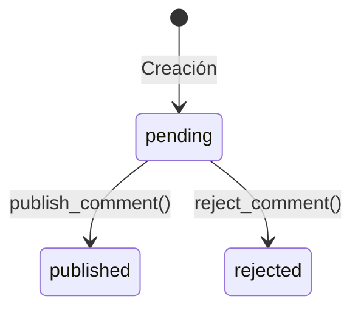

# Feedback Moderation — Módulo Nivel 3

> **Módulo de moderación comunitaria** que gestiona el ciclo de vida de sugerencias y comentarios ciudadanos, implementa relaciones Many-to-Many, seguridad dinámica con filtrado por dominio y una máquina de estados completa con cobertura de tests unitarios.

---

## Índice

- [Arquitectura y Manifiesto](#arquitectura-y-manifiesto)
- [Modelo de Datos](#modelo-de-datos)
- [Máquina de Estados (State Machine)](#máquina-de-estados-state-machine)
- [Matriz de Trazabilidad de Seguridad (ACL)](#matriz-de-trazabilidad-de-seguridad-acl)
- [Lógica de Servicios y API Autogenerada](#lógica-de-servicios-y-api-autogenerada)
- [Pruebas Unitarias de Lógica de Negocio](#pruebas-unitarias-de-lógica-de-negocio)
- [Guía de Troubleshooting (Lecciones Aprendidas)](#guía-de-troubleshooting-lecciones-aprendidas)

---

## Arquitectura y Manifiesto

### Estructura del módulo

El módulo `feedback_moderation` sigue la arquitectura estándar de Licium con separación estricta en capas:

```
modules/feedback_moderation/
├── __init__.py              # Registro: importa models y services
├── __manifest__.yaml        # Metadatos, dependencias y orden de carga
├── models/                  # 🗄️  Capa de Datos
│   ├── __init__.py          #     Importa suggestion, comment, tag
│   ├── suggestion.py        #     Modelo principal + relación M2M
│   ├── comment.py           #     Comentarios asociados a sugerencias
│   └── tag.py               #     Etiquetas + tabla de asociación M2M
├── services/                # ⚙️  Capa de Negocio
│   ├── __init__.py
│   ├── suggestion.py        #     publish / reject / merge / reopen
│   ├── comment.py           #     publish_comment / reject_comment
│   └── tag.py               #     CRUD base (sin acciones custom)
├── views/                   # 🖼️  Capa de Presentación (YAML)
│   ├── views.yml            #     Listas, formularios y row_actions
│   └── menu.yml             #     Menú, acciones de ruta
├── data/                    # 🔐 Seguridad y Configuración
│   ├── groups.yml           #     Grupos: Público (Viewer) + Moderador
│   ├── acl_rules.yml        #     Reglas ACL con dominio condicional
│   └── ui_modules.yml       #     Registro del módulo en el frontend
└── tests/                   # ✅ Pruebas Unitarias
    ├── __init__.py
    └── test_suggestion_states.py
```

### Manifiesto (`__manifest__.yaml`)

```yaml
name: Feedback Moderation
technical_name: "feedback_moderation"
version: "1.0.0"
category: Moderation
summary: Gestor de sugerencias y moderación de comentarios.
depends:
  - core           # Obligatorio: modelos base, BaseService, ACL
  - ui             # Obligatorio: para registrar ui.view y ui.menuitem
data:
  - data/groups.yml       # 1️⃣ Primero: crear grupos de seguridad
  - data/acl_rules.yml    # 2️⃣ Segundo: reglas ACL (dependen de los grupos)
  - data/ui_modules.yml   # 3️⃣ Tercero: registro en UI
  - views/views.yml       # 4️⃣ Cuarto: definir vistas
  - views/menu.yml        # 5️⃣ Quinto: menú y acciones
```

> **⚠️ Dependencia `ui`**: Si se omite `- ui` en el campo `depends`, el framework no registrará los modelos `ui.view` y `ui.menuitem`, y las vistas serán **invisibles** en el frontend (ver [Troubleshooting](#vistas-invisibles-en-el-frontend)).

### Imports críticos

Licium utiliza **rutas absolutas** para todas las importaciones del core:

```python
from app.core.base import Base           # ORM Base
from app.core.base import BaseService    # Service Base
from app.core.fields import field        # Factoría de columnas Licium
from app.core.services import exposed_action  # Decorador de acciones
from app.core.serializer import serialize     # Serialización de modelos
```

Usar rutas relativas como `from base import Base` **provocará un `ModuleNotFoundError`** porque el framework ejecuta el código desde el directorio raíz del proyecto, no desde la carpeta del módulo.

---

## Modelo de Datos

El módulo define tres entidades principales con una relación Many-to-Many entre `Suggestion` y `Tag`:



### `Suggestion` — Sugerencias

Entidad principal del módulo. Representa una propuesta ciudadana sometida a moderación.

| Campo | Tipo | Propósito |
|-------|------|-----------|
| `title` | `String(180)` | Título descriptivo de la sugerencia |
| `content` | `Text` | Cuerpo de la propuesta |
| `status` | `String(20)` | Estado: `pending` · `published` · `rejected` · `merged` |
| `author_name` | `String(100)` | Nombre del ciudadano (opcional) |
| `author_email` | `String(150)` | Email de contacto (opcional) |
| `is_public` | `Boolean` | Visibilidad pública (controlada por moderación) |
| `moderation_note` | `Text` | Nota interna del moderador |
| `published_at` | `DateTime(tz)` | Fecha de publicación (`editable=False`, auto) |
| `reviewed_by_id` | **`Uuid`**, `FK → core_user.id` | Moderador que revisó la sugerencia |

> **⚠️ Nota técnica sobre `reviewed_by_id`**: Este campo **debe ser de tipo `Uuid`** (no `Integer`) porque la tabla `core_user.id` del framework Licium es de tipo UUID. Usar `Integer` provoca un error `DatatypeMismatch` irreversible en PostgreSQL (ver [Troubleshooting](#error-de-tipos-en-foreign-keys-a-core_user)).

#### Relaciones

- **`reviewed_by`** → `User` (Many-to-One): Moderador que revisó la sugerencia.
- **`tags`** → `Tag` (Many-to-Many): Etiquetas clasificatorias, vía tabla intermedia `feedback_moderation_suggestion_tag_rel`.

### `Comment` — Comentarios

Comentarios asociados a una sugerencia, con su propio ciclo de moderación.

| Campo | Tipo | Propósito |
|-------|------|-----------|
| `suggestion_id` | `Integer`, `FK → suggestion.id` | Sugerencia padre (CASCADE) |
| `content` | `Text` | Cuerpo del comentario |
| `status` | `String(20)` | `pending` · `published` · `rejected` |
| `author_email` | `String(150)` | Email del autor (opcional) |
| `is_public` | `Boolean` | Visibilidad pública |
| `published_at` | `DateTime(tz)` | Fecha de publicación (auto) |

### `Tag` — Etiquetas

Etiquetas reutilizables para clasificar sugerencias. Relacionadas con `Suggestion` vía **Many-to-Many**.

| Campo | Tipo | Propósito |
|-------|------|-----------|
| `name` | `String(100)` | Nombre visible (ej. "Medio Ambiente") |
| `slug` | `String(100)` | Identificador URL-safe (ej. `medio-ambiente`) |
| `color` | `String(20)` | Color hexadecimal para chips de UI |

#### Tabla de asociación M2M

```python
suggestion_tag_rel = Table(
    "feedback_moderation_suggestion_tag_rel",
    Base.metadata,
    Column("suggestion_id", Integer,
           ForeignKey("feedback_moderation_suggestion.id", ondelete="CASCADE"),
           primary_key=True),
    Column("tag_id", Integer,
           ForeignKey("feedback_moderation_tag.id", ondelete="CASCADE"),
           primary_key=True),
)
```

La tabla de asociación utiliza `ondelete="CASCADE"` en ambas FK para que, al eliminarse una sugerencia o una etiqueta, las relaciones intermedias se eliminen automáticamente.

---

## Máquina de Estados (State Machine)

### Diagrama de estados de `Suggestion`



### Tabla de transiciones

| Estado Origen | Acción | Estado Destino | Efectos Secundarios |
|:---:|:---:|:---:|:---|
| `pending` | `publish()` | `published` | `is_public → true`, `published_at → now()`, nota opcional |
| `pending` | `reject()` | `rejected` | `is_public → false`, nota **obligatoria** |
| `pending` | `merge()` | `merged` | `is_public → false`, referencia a `target_id` |
| `published` | `reopen()` | `pending` | `is_public → false`, `published_at → null`, nota limpiada |
| `rejected` | `reopen()` | `pending` | Reinicia a estado inicial |
| `merged` | `reopen()` | `pending` | Reinicia a estado inicial |

### Diagrama de estados de `Comment`



Los comentarios tienen un ciclo de vida más simple: solo transiciones de `pending` a `published` o `rejected`, sin acción de reapertura.

---

## Matriz de Trazabilidad de Seguridad (ACL)

### Grupos de seguridad

| Grupo | `ext_id` | Hereda de | Propósito |
|-------|----------|-----------|-----------|
| **Público / Visualizador** | `feedback_group_viewer` | `core_group_public` | Lectura filtrada + crear sugerencias/comentarios |
| **Moderador** | `feedback_group_moderator` | `feedback_group_viewer` | CRUD completo + acciones de moderación |

> **Herencia de grupos**: El Moderador hereda del Viewer, por lo que automáticamente dispone de todos sus permisos base. No es necesario duplicar las reglas de lectura.

### Matriz de permisos

| Grupo | Modelo | Ver | Crear | Editar | Borrar | Condición (Domain) |
|:---|:---|:---:|:---:|:---:|:---:|:---|
| **Moderador** | `feedback_moderation.*` | ✅ | ✅ | ✅ | ✅ | Sin restricciones (wildcard `*`) |
| **Público** | `Suggestion` | ✅ | ✅ | ❌ | ❌ | `status='published' AND is_public=true` |
| **Público** | `Comment` | ✅ | ✅ | ❌ | ❌ | `status='published' AND is_public=true` |
| **Público** | `Tag` | ✅ | ❌ | ❌ | ❌ | Lectura total (sin dominio; necesario para desplegables) |

### Implementación en `acl_rules.yml`

```yaml
# Moderador: poder absoluto con wildcard
- model: core.aclrule
  ext_id: feedback_acl_moderator_all
  fields:
    group_id.ext_id: feedback_group_moderator
    model_key: "feedback_moderation.*"        # ← Wildcard: cubre TODOS los modelos
    perm_read: true
    perm_create: true
    perm_write: true
    perm_delete: true

# Público: solo lee sugerencias PUBLICADAS y PÚBLICAS
- model: core.aclrule
  ext_id: feedback_acl_viewer_read_suggestion
  fields:
    group_id.ext_id: feedback_group_viewer
    model_key: "feedback_moderation.suggestion"
    perm_read: true
    domain:
      - { field: "status", operator: "=", value: "published" }
      - { field: "is_public", operator: "=", value: true }
```

**¿Por qué es importante el `domain`?** Sin estas reglas de dominio, un usuario público podría ver sugerencias en estado `pending` o `rejected` a través de la API, exponiendo contenido sin moderar. El dominio actúa como un **filtro obligatorio a nivel de ORM** que Licium inyecta en las queries SQL.

---

## Lógica de Servicios y API Autogenerada

### `SuggestionService` — Acciones expuestas

El servicio principal utiliza el decorador `@exposed_action` para definir acciones que:

1. Se convierten automáticamente en **endpoints REST**.
2. Se vinculan a **botones de UI** en las vistas YAML.
3. Generan **formularios modales automáticos** basados en la firma del método.

```python
class SuggestionService(BaseService):
    from ..models.suggestion import Suggestion

    @exposed_action("write", groups=["feedback_group_moderator", "core_group_superadmin"])
    def publish(self, id: int, note: str | None = None, pin: bool = False) -> dict:
        """Publica una sugerencia y la hace visible al público."""
        record = self.repo.session.get(self.Suggestion, int(id))
        if not record:
            raise HTTPException(404, "Sugerencia no encontrada")
        
        if record.status == "published":
            raise HTTPException(400, "Esta sugerencia ya está publicada.")

        record.status = "published"
        record.is_public = True
        record.published_at = dt.datetime.now(dt.timezone.utc)
        
        if note:
            record.moderation_note = note

        self.repo.session.add(record)
        self.repo.session.commit()
        self.repo.session.refresh(record)
        return serialize(record)
```

### Formularios Automáticos a partir del tipado Python

Licium inspecciona la **firma del método** para generar la UI del diálogo sin código frontend:

| Firma Python | UI Generada |
|:---|:---|
| `note: str \| None = None` | Campo de texto **opcional** |
| `note: str` | Campo de texto **obligatorio** |
| `pin: bool = False` | Interruptor (switch/toggle) con valor por defecto `false` |
| `target_id: int` | Campo numérico **obligatorio** |

#### Ejemplo visual: `publish()`

```
┌────────────────────────────────────┐
│         Publicar Sugerencia        │
├────────────────────────────────────┤
│                                    │
│  Nota de moderación (opcional):    │
│  ┌────────────────────────────┐    │
│  │                            │    │
│  └────────────────────────────┘    │
│                                    │
│  Fijar sugerencia:    [ OFF ]      │
│                                    │
│         [Cancelar]  [Aceptar]      │
└────────────────────────────────────┘
```

Este diálogo se genera **automáticamente** a partir de `def publish(self, id: int, note: str | None = None, pin: bool = False)` — sin escribir YAML ni JavaScript adicional.

### `CommentService` — Moderación de comentarios

| Acción | Parámetros | Efecto |
|--------|------------|--------|
| `publish_comment()` | `id`, `note: str \| None` | `status → published`, `is_public → true` |
| `reject_comment()` | `id`, `note: str` (obligatoria) | `status → rejected`, `is_public → false` |

### `TagService` — CRUD base

```python
class TagService(BaseService):
    from ..models.tag import Tag
    # No se requieren acciones personalizadas, el CRUD base es suficiente.
```

Las etiquetas no necesitan lógica de negocio adicional: el `BaseService` proporcionado por Licium ya incluye operaciones CRUD completas (create, read, update, delete).

### Integración con vistas: `row_actions`

Las acciones del servicio se vinculan a la UI mediante `row_actions` en `views.yml`:

```yaml
row_actions:
  - key: action_publish
    type: service
    label: "Publicar"
    icon: mdi-check-circle
    method: publish                           # ← Llama a SuggestionService.publish()
    model_key: feedback_moderation.suggestion
    groups: [feedback_group_moderator, core_group_superadmin]
    
  - key: action_reject
    type: service
    label: "Rechazar"
    icon: mdi-close-circle
    method: reject
    model_key: feedback_moderation.suggestion
    groups: [feedback_group_moderator, core_group_superadmin]

  - key: action_merge
    type: service
    label: "Fusionar"
    icon: mdi-source-merge
    method: merge
    model_key: feedback_moderation.suggestion
    groups: [feedback_group_moderator, core_group_superadmin]
```

### Ciclo completo: del botón al backend

```
 Clic "Publicar"     Diálogo auto        POST /api/...          Service
      (UI)        ──▶  note: str?    ──▶  publish()        ──▶  status = "published"
                       pin: bool?          id + note + pin       is_public = true
                       [Aceptar]                                 published_at = now()
```

---

## Pruebas Unitarias de Lógica de Negocio

### Archivo: `tests/test_suggestion_states.py`

El módulo incluye tests unitarios que validan las transiciones de estado **sin necesidad de una base de datos real**, utilizando `pytest` y `unittest.mock`.

### Estrategia de testing

1. **Simulación del repositorio**: Se usa `MagicMock()` para crear un repositorio falso con una sesión de base de datos simulada.
2. **Inyección en el servicio**: Se pasa el mock al constructor de `SuggestionService`.
3. **Validación de estados**: Se comprueba que los campos cambian correctamente tras cada acción.

```python
@pytest.fixture
def mock_service():
    """Crea una instancia del servicio con una base de datos simulada."""
    mock_repo = MagicMock()
    mock_repo.session = MagicMock()
    service = SuggestionService(mock_repo)
    return service
```

### Tests implementados

| Test | Verifica |
|------|----------|
| `test_publish_suggestion_success` | `pending → published`, `is_public = true`, `published_at ≠ null`, nota asignada |
| `test_publish_already_published_raises_error` | HTTPException 400 si ya está publicada |
| `test_reject_suggestion` | `pending → rejected`, `is_public = false`, nota obligatoria asignada |
| `test_merge_suggestion_with_itself_raises_error` | HTTPException 400 al fusionar consigo misma (validación defensiva) |

### Ejemplo: test de publicación exitosa

```python
def test_publish_suggestion_success(mock_service):
    # 1. Preparamos una sugerencia en estado "pending"
    mock_suggestion = Suggestion(id=1, status="pending", is_public=False)
    mock_service.repo.session.get.return_value = mock_suggestion

    # 2. Ejecutamos la acción de publicar
    mock_service.publish(id=1, note="Buena idea")

    # 3. Comprobamos la transición de estado
    assert mock_suggestion.status == "published"
    assert mock_suggestion.is_public is True
    assert mock_suggestion.moderation_note == "Buena idea"
    assert mock_suggestion.published_at is not None
```

### Ejecución de los tests

```bash
docker exec -it licium-backend-dev python -m pytest modules/feedback_moderation/tests/ -v
```

Salida esperada:

```
tests/test_suggestion_states.py::test_publish_suggestion_success       PASSED
tests/test_suggestion_states.py::test_publish_already_published_raises_error  PASSED
tests/test_suggestion_states.py::test_reject_suggestion                PASSED
tests/test_suggestion_states.py::test_merge_suggestion_with_itself_raises_error  PASSED

========================= 4 passed in 0.12s =========================
```

---

## Guía de Troubleshooting (Lecciones Aprendidas)

### Error de tipos en Foreign Keys a `core_user`

**Síntoma**: Al ejecutar `docker exec ... install`, PostgreSQL lanza:

```
sqlalchemy.exc.ProgrammingError: (psycopg2.errors.DatatypeMismatch)
  foreign key constraint ... cannot be implemented
  Key columns "reviewed_by_id" and "id" are of incompatible types: integer and uuid.
```

**Causa**: Se definió `reviewed_by_id` como `Integer` pero la columna `core_user.id` es de tipo `UUID` en Licium.

**Solución**:

```diff
- reviewed_by_id = field(Integer, ForeignKey("core_user.id"), ...)
+ reviewed_by_id = field(Uuid, ForeignKey("core_user.id"), ...)
```

Y añadir `Uuid` al import de SQLAlchemy:

```python
from sqlalchemy import Boolean, DateTime, ForeignKey, Integer, String, Text, Uuid
```

> **Regla general**: Cualquier FK que referencie a `core_user.id` debe ser de tipo **`Uuid`**, nunca `Integer`.

---

### Importaciones circulares y `ModuleNotFoundError`

**Síntoma**: Al arrancar el backend, Python lanza `ImportError` o `ModuleNotFoundError`.

**Causa(s) comunes**:

1. **Falta `__init__.py`** en una subcarpeta (`models/`, `services/`, `tests/`).
2. **Importaciones cruzadas** entre modelos y servicios a nivel de módulo raíz.

**Solución**:

1. Asegurar que **cada subcarpeta** tenga un archivo `__init__.py`:

```
models/__init__.py       →  from . import suggestion, comment, tag
services/__init__.py     →  from . import suggestion, comment, tag
tests/__init__.py        →  (vacío, pero necesario)
```

2. En los servicios, importar modelos **dentro de la clase** (lazy import):

```python
class SuggestionService(BaseService):
    from ..models.suggestion import Suggestion   # ← Dentro de la clase, NO a nivel de módulo
```

Esto evita que Python intente resolver todas las dependencias al cargar el archivo, rompiendo la cadena circular.

---

### Vistas invisibles en el frontend

**Síntoma**: El módulo se instala sin errores, pero no aparece ningún menú ni vista en el frontend.

**Causa**: Falta la dependencia `- ui` en el campo `depends` del `__manifest__.yaml`.

**Solución**:

```yaml
depends:
  - core
  - ui          # ← OBLIGATORIO para que se registren ui.view y ui.menuitem
```

Sin esta dependencia, Licium no carga los modelos `ui.view`, `ui.action` ni `ui.menuitem`, por lo que todas las definiciones en `views.yml` y `menu.yml` son ignoradas silenciosamente.

Después de corregir el manifiesto, reinstalar el módulo:

```bash
docker exec -it licium-backend-dev \
  python -m app.cli.module install modules/feedback_moderation -y
```

---

### Caché de Docker: cuándo usar `down -v`

**Síntoma**: Tras cambiar el tipo de una columna (ej. de `Integer` a `Uuid`), la reinstalación del módulo sigue fallando con el mismo error de tipos.

**Causa**: PostgreSQL ya creó la tabla con la columna anterior. El sistema de migración de Licium no altera tipos de columnas existentes automáticamente.

**Solución**: Destruir el volumen de PostgreSQL y reinstalar desde cero:

```bash
# 1. Destruir contenedores Y volúmenes
docker compose -f docker-compose.backend-dev.yml down -v

# 2. Reconstruir contenedores
docker compose -f docker-compose.backend-dev.yml up -d

# 3. Instalación base
# Navegar a: http://localhost:8000/api/install

# 4. Reinstalar TODOS los módulos
docker exec -it licium-backend-dev \
  python -m app.cli.module install modules/practice_checklist -y

docker exec -it licium-backend-dev \
  python -m app.cli.module install modules/asset_lending -y

docker exec -it licium-backend-dev \
  python -m app.cli.module install modules/feedback_moderation -y
```

> **⚠️ Cuidado**: `down -v` elimina **todos los datos** del volumen de PostgreSQL. Solo usar cuando sea necesario (cambios de tipos de columnas, corrupción de esquema, etc.).

---

## Resumen de Hitos Técnicos

| Hito | Descripción |
|------|-------------|
| ✅ Relación Many-to-Many | `Suggestion` ↔ `Tag` con tabla de asociación y `back_populates` |
| ✅ Máquina de estados completa | 4 estados (`pending`, `published`, `rejected`, `merged`) con transiciones controladas |
| ✅ Acción `reopen()` | Permite devolver cualquier sugerencia a `pending` (reversibilidad) |
| ✅ Seguridad con Domain Rules | Filtrado ACL en tiempo real: el público solo ve `published + is_public` |
| ✅ Wildcard `*` para moderadores | Una sola regla ACL cubre todos los modelos del módulo |
| ✅ Formularios autogenerados | `publish(note: str \| None, pin: bool)` → modal con campo de texto + switch |
| ✅ `row_actions` + `header_actions` | Botones contextuales en listas y formularios |
| ✅ Tests unitarios con mock | 4 tests cubriendo transiciones y validaciones de estado |
| ✅ Validación defensiva | HTTPException 400 para publicación duplicada y fusión consigo misma |
| ✅ FK con tipo `Uuid` | Referencia correcta a `core_user.id` evitando `DatatypeMismatch` |
